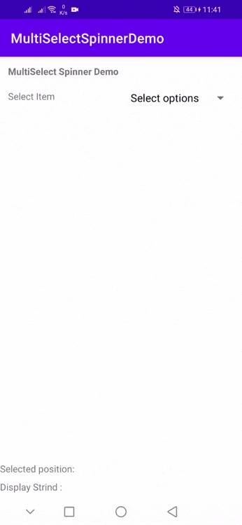
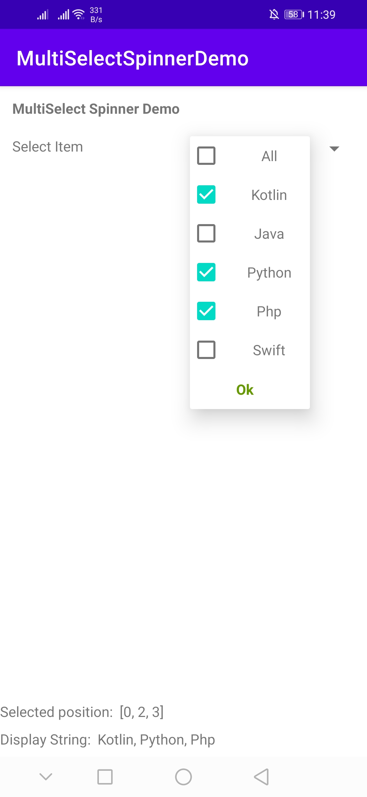

# MultiSelectSpinner 
Android Library for Dropdown MultiSelect Spinner functionality


 &nbsp;&nbsp;&nbsp; 

## Installation - Gradle

```bash
dependencies {
    ...
    implementation 'com.github.puskal-khadka:MultiSelectSpinner:1.0.1'
}
```


## Usage

```bash
<com.puskal.multiselectspinner.MultiSelectSpinnerView
     android:id="@+id/multiSelectSpinner"
     android:layout_width="wrap_content"
     android:layout_height="wrap_content"
     android:layout_marginEnd="8dp"
  />
```


## Setting Up

 - Make a list of string which you want to show in drodown. If you have list of object then you can map it into string list
 - Use buildCheckedSpinner method of library and send string list as parameter with listener
 - onChecking Checkbox it will return position of selected item. Here in dropdown you will get two addition field "All" and "OK", 
   Returned Position is on the basis of your original list. "All" or "OK" will not consider as a part of list
```kotlin
    val testDataList = arrayListOf("Kotlin", "Java", "Python", "Php", "Swift")
        with(binding) {
            multiSelectSpinner.buildCheckedSpinner(testDataList){ selectedPositionList, displayString ->
                tvSelectedPosition.text = "Selected position:  $selectedPositionList" //if kotlin, python selecteed:returned postion will be 0,2
                tvDispString.text = "Display String:  $displayString"
            }
        }
```

## Contribution
Pull requests are welcome. For major changes, please open an issue first to discuss what you would like to change.
